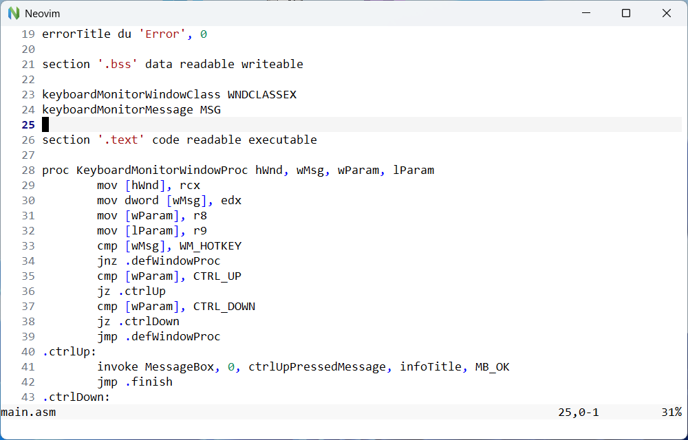

# FlatIDE

FlatIDE is a lightweight development environment for FASM2 (Flat Assembler 2) built on Neovim.  
It provides syntax highlighting, a minimal colorscheme, Windsurf/Codeium integration, and Telescope for file navigation.



## Features

- FASM2 syntax highlighting
- Minimal, high-contrast colorscheme
- Integration with Windsurf/Codeium
- Telescope-based file and buffer search
- Lightweight and fast
- Add additional plugins using lazy.nvim

## Requirements

- FASM2
- Neovim 0.11+
- Git
- Gzip
- Windsurf/Codeium account (optional)

## Installation

Follow these steps to install and set up FlatIDE:

1. Install Neovim
   - Download the latest Neovim release from the [official website](https://neovim.io/).
   - On Windows: install Neovim and make sure its `bin` directory (e.g. `C:\Program Files\Neovim\bin`) is in your system `PATH`.
   - On Linux/macOS: use your package manager (e.g. `sudo apt install neovim` or `brew install neovim`).
2. Install Git
   - On Windows: download and install [Git for Windows](https://gitforwindows.org/).
   - On Linux: install using your package manager (e.g. `sudo apt install git`).
   - On macOS: install Xcode or the Xcode command line tools.
   - Verify the installation by running:
     ```sh
     git --version
     ```
3. Install Gzip
   - On Windows: make sure `gzip.exe` from Git for Windows is available in your system `PATH`.
   - On Linux/macOS: Gzip is usually preinstalled.
4. Clone this repository as a Neovim configuration
   - Neovim looks for configuration files in a directory based on the `NVIM_APPNAME` environment variable.
   - Clone this repository into your Neovim config folder with the same name as this project:
     ```sh
     # Windows (CMD)
     git clone https://github.com/hofmann-development/flatide %USERPROFILE%\flatide

     # Linux/macOS
     git clone https://github.com/hofmann-development/flatide ~/.config/flatide
     ```
5. Install FlatIDE launcher scripts
   - Clone [flatide-launcher](https://github.com/hofmann-development/flatide-launcher) to a directory of your choice.
   - Add that directory to your `PATH`.
6. Start FlatIDE and set up Windsurf/Codeium
   - Run the launcher script (e.g. `flatide hello.asm`).
   - Use `:Codeium Auth` to enable Codeium (optional).

## Known bugs

- Telescope does not respect modlines

## License

MIT
